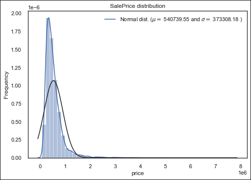

# Housing_Predictions_Model
This project is for Phase 2 at Flatiron School. We just several independent variables from the Kings County housing market in Seattle, Washington to predict what attributes have the greatest impact on selling a house.  

## Precting Housing Prices for Seattle, Washington
Our company was hired to use model predictions to predict our housing prices in the Seatle, WA area. 
In order to make the best possible predictions for the housing market of Seattle, WA, our company 
takes in numerous amounts of paramters that are independent of the price of the house to create the 
best model prediction to inform future buyers. 

 
 

# Overview:

- Explore the data
- Create visualization
- Clean our data
- Create new features
- Perfecm model test
- Grab the best features 

# Eploration:

We explore the data set with visualizations of how our variables effect price; if any extreme outliers in are data sets, 
we can correct for these. We first start with see how are data is distrubuted, overlaying a dsitrubuted scale, and check for linearity. 

 

We can see that are data set is not normally distrubted and this is skewed to the right. We can correct this by cleaning up our data set,
and checking for outliers. As well we can see that our data fits a more exponential curve rather than a linear fit line. This will all be 
corrected for when we clean up our data, create new features and pick what features will produce the best model.

# Features

* ID - unique ID for a house
* Date - Date day house was sold
* Price - Price is prediction target
* Bedrooms - Number of bedrooms
* Bathrooms - Number of bathrooms
* Sqft_lving - square footage of the home
* Sqft_lot - square footage of the lot
* Floors - Total floors (levels) in house
* Waterfront - Whether house has a view to a waterfront
* View - Number of times house has been viewed
* Condition - How good the condition is (overall)
* Grade - overall grade given to the housing unit, based on King County grading system
* Sqft_above - square footage of house (apart from basement)
* Sqft_basement - square footage of the basement
* Yr_built - Year when house was built
* Yr_renovated - Year when house was renovated
* Zipcode - zip code in which house is located
* Lat - Latitude coordinate
* Long - Longitude coordinate
* Sqft_living15 - The square footage of interior housing living space for the nearest 15 neighbors
* Sqft_lot15 - The square footage of the land lots of the nearest 15 neighbors

- We first want to see how each feature is skewed and if any outliers exist.

 
 

After understanding our outliers, we cleaned up our data and create new features that will we know will effect our predictions. We know that the number of number of bedrooms, bathrooms, and how much space you have in your living quarters will make or break a the selling of a house. We also know the ratio of bedroom and bathoom, the amount of square feet you have in your house and your property will diswade a buyer. This will greatly effect our the price of the house. 

 
 

 
